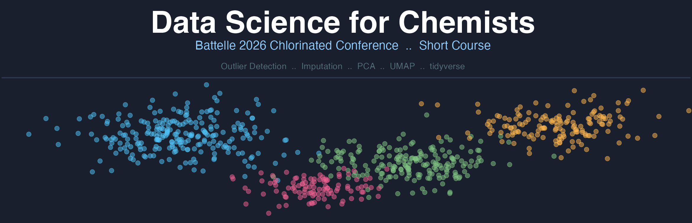

# Data Science for Chemists — Battelle 2026 Short Course

An interactive Shiny app built for the **Battelle 2026 Chlorinated Conference** short course. Participants can explore data science concepts applied to environmental chemistry — from data structures and matrix operations to outlier detection, imputation, and dimensionality reduction — all using realistic simulated PFAS/PCB/PAH datasets.

---

## Live App

**[Launch the Shiny App](https://26pt4q-mike-dereviankin.shinyapps.io/data-science-for-chemists/)**

> No installation required — runs in any browser.

---

## Course Content

### Chapter 1: Introduction to Data Science
| Section | Topics |
|---|---|
| Dataset Generation | Simulated environmental dataset (60 samples, 9 analytes, non-detects) |
| Data Structures | Vectors, matrices, arrays, and data frames in R |
| Matrix Operations | Addition, subtraction, and matrix multiplication |
| Data Manipulation | Subset, split, pivot wide ↔ long, and joins |
| Plots | Detection rate bar charts, concentration boxplots with ggplot2 |

### Chapter 2: Data Pre-processing
| Section | Topics |
|---|---|
| Outliers — IQR | Univariate outlier detection via interquartile range |
| Outliers — Mahalanobis | Multivariate outlier detection and chemical fingerprinting |
| Missing Values | NA patterns by analyte and sample, missingness heatmap |
| Imputation | RL/2, least-squares (LM), kNN, and MICE — with diagnostic plots |
| Feature Scaling | log₁₀, min-max, percent normalization, Shapiro-Wilk normality tests |

### Chapter 5: PCA vs UMAP
| Section | Topics |
|---|---|
| Dimensionality Reduction | Side-by-side PCA and UMAP using NHANES biomarker data |
| Interactive Parameters | Adjust `n_neighbors` and `min_dist` and re-run UMAP live |
| Color by Demographics | UMAP colored by age group |

---

## Running Locally

### 1. Install required packages
```r
install.packages(c("shiny", "bslib", "tidyverse", "DT",
                   "mice", "VIM", "umap", "cowplot"))
```

### 2. Clone the repository
```bash
git clone https://github.com/MikeDereviankin/data-science-for-chemists.git
cd data-science-for-chemists
```

### 3. Launch the app
```r
shiny::runApp()
```

> **Note:** The app pre-computes all analyses at startup (including MICE imputation). Allow ~20 seconds for the initial load.

---

## Repository Structure

```
data-science-for-chemists/
├── app.R          # Full Shiny application (single-file)
├── NHANES.csv     # NHANES biomarker dataset used in Chapter 5
└── README.md
```

---

## Data

- **Chapters 1 & 2** use a fully synthetic dataset generated with `set.seed(42)`. No real data — every participant sees identical results.
- **Chapter 5** uses publicly available NHANES biomarker data (PCB congeners, columns 7–41).

---

## About

Presented at the **Battelle 2026 Chlorinated Conference**.
Built with [R](https://www.r-project.org/) · [Shiny](https://shiny.posit.co/) · [tidyverse](https://www.tidyverse.org/) · [bslib](https://rstudio.github.io/bslib/)
